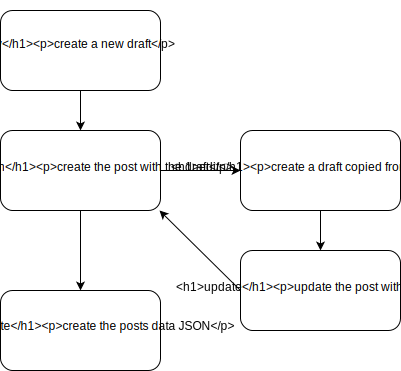

SSG prototype
=============

a prototype of static site generator


## Concept




## Requirement

- Node v8.11.3 or later


## Installation

```
yarn global add ssg-prototype
```

or

```
npm i -g ssg-prototype
```


## Directory structure

```
├── ssgconfig.json
├── posts/
│   └── YYYY/
│   │   └── MM/
│   │         └── DD/
│   │              └── post-name/
│   │                   ├── index.asciidoc
│   │                   └── foo.png
└── drafts/
     ├── draft-name/
     │   ├── index.asciidoc
     │   └── bar.png
```

The directories `posts/` and `drafts/` is created at first time you execute the any command.

The path `YYYY/MM/DD` represents the publish date of the post.

About `ssgconfig.json`, see [Configuration](#configuration).


## Usage

```
ssg-prototype --help
```

### init project

This tool requires package.json.

### Create a new draft

```
ssg-prototype new <name>
```

This command creates the Asciidoc document `./drafts/name/index.asciidoc`.

Edit it and publish them.

### Publish the draft

```
ssg-prototype publish <name>
```

This command moves the directory `./drafts/name/` into `./posts/YYYY/MM/DD/name/`.

### Edit the post

```
ssg-prototype edit <name>
```

This command copies the directory `./drafts/name/` from `./posts/YYYY/MM/DD/name/`

Edit the document and update them.

### Update the post with the draft

```
ssg-prototype update <name>
```

This command removes the directory `./posts/YYYY/MM/DD/name/`, and moves the directory `./posts/YYYY/MM/DD/name/` from `./drafts/name/`.

### Generate the posts data

```
ssg-prototype generate
```

This command creates the posts data JSON `./posts.json`.


## Post attributes

```
= Title
author <email>
:revdate: 2018-07-30T13:02:04+09:00
:revnumber: v1.3.2
:tags: JavaScript,Node,Commaner.js
:summary: This is a summary.
:toc:
```

The header of Asciidoc is required.

- title

- author (optinal email)

- revnumber

This attribute is required.

- tags

- summary

- toc

Table of contents.


## Configuration

Every command option can be specified in `./ssgconfig.json`.

```
{
  "posts-dir": "src/posts",   // default is "./posts"
  "drafts-dir": "src/drafts", // default is "./drafts"
  "author": "utakuma"         // default is "author"
}
```


## Author

[utakuma](https://github.com/utatatata)
